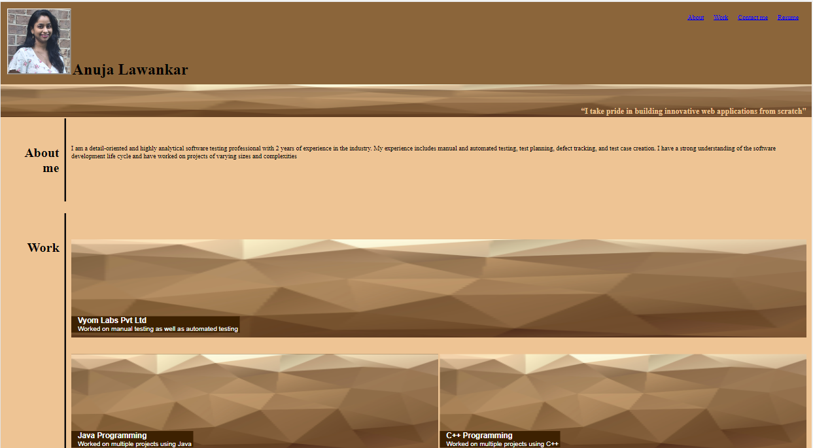

# assignment-module-2

## Description
 In my portfolio webpage, I added my skills, experience, and accomplishments as a software analyst. Here are some key elements in my portfolio:-

Subtitle:- I mention cool subtitle in my subtitle section.

About me: I mention my current status and also with education and experience.

Technical skills: A list of your technical skills, programming languages, tools, and frameworks that I learned.

Professional experience: A summary of my work experience as a software analyst, including my roles and responsibilities.

Contact information: Finally, included my contact information, such as email and gitgub profile, so that potential employers or clients can easily reach out to me.

## Installation

N/A

## Usage

## Credits

N/A

## License

N/A

## Assets

The following image demonstrates the website appearance:

